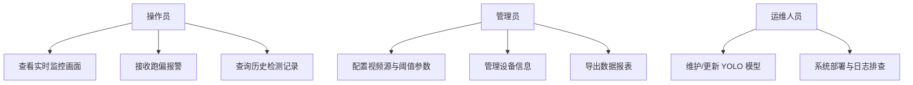
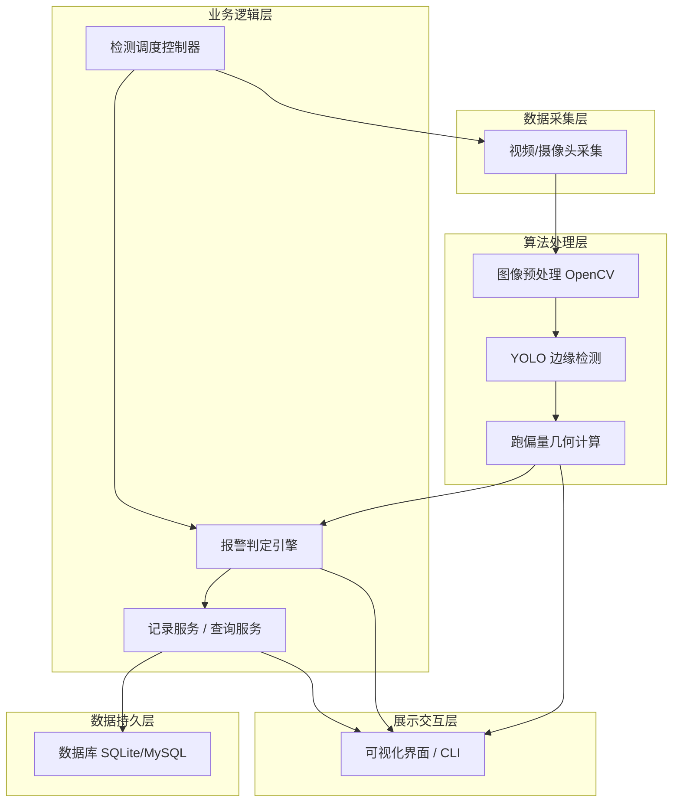
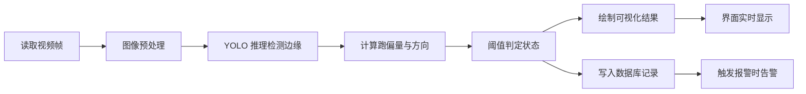
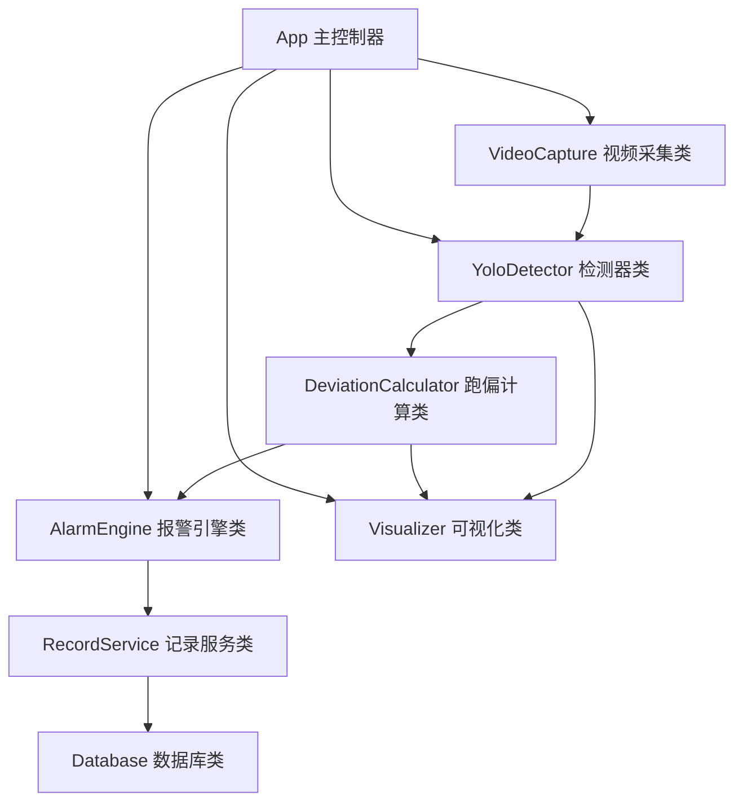
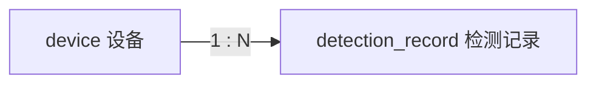

# 皮带偏移智能识别系统 · 项目说明文档

> Conveyor Belt Deviation Recognition System
> 基于 YOLO + OpenCV 的传送带跑偏机器视觉检测项目

---

## 文档信息

| 项目 | 内容 |
| --- | --- |
| 项目名称 | 皮带偏移智能识别系统（Conveyor Belt Deviation Recognition） |
| 项目类型 | 软件工程项目训练实践 · 机器视觉方向 |
| 文档版本 | v1.0 |
| 编写人 | 项目组长 |
| 编写日期 | 2026-09 |
| 适用阶段 | 立项 / 需求分析 / 系统设计 / 开发 / 测试 / 部署 |

### 修订记录

| 版本 | 日期 | 修订人 | 修订说明 |
| --- | --- | --- | --- |
| v1.0 | 2026-09 | 项目组长 | 初稿，完成背景、目的、技术选型与架构设计 |

---

## 1. 项目背景

### 1.1 行业背景

传送带（皮带输送机）是煤矿、港口、冶金、水泥、电力、物流分拣等行业中应用最广泛的连续输送设备。在长期运行过程中，由于以下原因，皮带经常发生**跑偏（Deviation / Misalignment）**：

- 物料落点不均，导致皮带两侧受力不平衡；
- 滚筒、托辊安装误差或磨损，轴线不平行；
- 皮带接头不正、张紧力不足或老化变形；
- 机架沉降、振动以及长期负载变化。

皮带跑偏是输送机最常见的故障之一。一旦发生严重跑偏，会造成：

- 皮带边缘与机架摩擦，导致**皮带撕裂、磨损、烧毁**；
- 物料洒落，污染环境并造成资源浪费；
- 摩擦生热可能引发**火灾**（煤矿场景尤为危险）；
- 被迫停机检修，带来**停产经济损失**。

### 1.2 现状与痛点

传统的跑偏检测主要依赖人工巡检和机械式跑偏开关（限位挡轮）：

| 方式 | 存在的问题 |
| --- | --- |
| 人工巡检 | 效率低、成本高、无法 24 小时值守、主观性强 |
| 机械式跑偏开关 | 只能在“已经严重跑偏并接触挡轮”后才报警，属于事后报警，无法预警 |
| 传统光电/激光传感器 | 安装标定复杂，受粉尘、光照干扰大，只能检测单点 |

随着**计算机视觉**与**深度学习目标检测**技术的成熟，采用工业相机采集皮带图像、利用 **YOLO 目标检测模型**识别皮带边缘，从而实时、非接触、可预警地判断跑偏，成为一种先进且可行的方案。

### 1.3 项目定位

本项目作为**软件工程项目训练实践**课题，既是一次完整的软件工程全流程演练，也是一个具备真实工业价值的机器视觉应用开发。项目组成员将完整参与**项目计划与管理、系统分析与设计、软件配置管理、开发/测试、部署**各环节，掌握 Python 软件开发、OpenCV 视频/图像处理以及数据库基本操作等核心技能。

---

## 2. 项目目的与意义

### 2.1 业务目标

1. 实现对传送带运行状态的**实时视觉监测**，自动识别皮带边缘位置；
2. 通过边缘位置计算**跑偏量与跑偏方向**，超过阈值时**及时分级报警**（预警 / 报警）；
3. 将检测过程、报警记录**持久化存入数据库**，支持历史查询与统计分析；
4. 提供**可视化监控界面**，实时展示视频画面、检测结果与报警信息。

### 2.2 训练（学习）目标

作为软件工程实训课题，项目还承担以下教学目标：

- **软件工程思想**：实践需求分析 → 设计 → 编码 → 测试 → 部署 → 维护的完整生命周期；
- **项目管理**：制定项目计划、任务分解（WBS）、进度与风险管理、团队分工协作；
- **配置管理**：使用 Git 进行版本控制、分支管理、代码评审与提交规范；
- **Python 开发**：掌握面向对象编程、模块化设计、依赖管理、虚拟环境；
- **计算机视觉**：掌握 OpenCV 视频/图像读取、预处理、绘制，以及 YOLO 模型推理；
- **数据库**：掌握关系型数据库的建表、增删改查（CRUD）与 ORM 基本操作。

### 2.3 预期成果（交付物）

- 可运行的皮带跑偏识别系统（源码 + 模型权重 + 配置）；
- 完整的项目文档（需求说明书、设计说明书、测试报告、部署手册、用户手册）；
- 数据集与训练好的 YOLO 模型；
- 项目总结与答辩 PPT。

---

## 3. 项目范围与需求分析

### 3.1 功能需求

| 编号 | 功能模块 | 需求描述 |
| --- | --- | --- |
| FR-01 | 视频/图像采集 | 支持读取本地视频文件、图片，以及 USB / RTSP 网络摄像头实时流 |
| FR-02 | 皮带边缘检测 | 使用 YOLO 模型对每一帧图像进行推理，识别皮带边缘/边界框 |
| FR-03 | 跑偏判定 | 根据检测框中心线与画面参考中线的偏移量，计算跑偏量与方向，判定是否跑偏 |
| FR-04 | 分级报警 | 支持“正常 / 预警 / 报警”多级状态，触发时界面高亮并可记录报警 |
| FR-05 | 结果可视化 | 在视频帧上绘制检测框、中心线、偏移量、状态文字，实时显示 |
| FR-06 | 数据存储 | 将检测记录、报警记录、设备信息写入数据库 |
| FR-07 | 历史查询 | 支持按时间、状态查询历史检测与报警记录 |
| FR-08 | 参数配置 | 支持配置视频源、跑偏阈值、检测间隔、置信度等参数 |

### 3.2 非功能需求

| 类别 | 需求描述 |
| --- | --- |
| 性能 | 单路视频检测帧率 ≥ 15 FPS（满足实时监控需求，具体取决于硬件） |
| 准确率 | 皮带边缘检测 mAP ≥ 0.85；跑偏判定准确率 ≥ 90% |
| 实时性 | 从采集到报警的端到端延迟 < 1 秒 |
| 可靠性 | 支持长时间连续运行，异常自动重连/日志记录 |
| 可维护性 | 模块化分层设计，配置与代码分离，完善的日志 |
| 可移植性 | 支持 Windows / Linux，CPU / GPU 均可运行（GPU 加速优先） |
| 易用性 | 界面简洁直观，参数配置简单 |

### 3.3 用例（角色与场景）



### 3.4 系统边界（范围外）

- 本项目**只做视觉检测与报警**，不涉及直接控制皮带纠偏执行机构（可作为扩展方向，通过接口输出控制信号）；
- 首期以**单路视频**为主，多路并发监控作为后续扩展。

---

## 4. 技术选型

### 4.1 总体技术栈

| 层次 | 技术/工具 | 版本建议 | 选型说明 |
| --- | --- | --- | --- |
| 开发语言 | Python | 3.9 ~ 3.11 | 生态丰富，AI/CV 领域首选，团队已具备 Python 基础 |
| 目标检测 | YOLO（Ultralytics YOLOv8 / YOLO11） | v8.x | 精度高、速度快、API 简洁、社区活跃、支持训练+推理一体化 |
| 图像处理 | OpenCV | 4.x | 视频/图像读取、预处理、绘制，机器视觉标准库 |
| 深度学习框架 | PyTorch | 2.x | Ultralytics 底层依赖，GPU 加速成熟 |
| 数据库 | SQLite（开发） / MySQL（生产可选） | - | SQLite 零配置便于实训；MySQL 用于正式部署 |
| ORM | SQLAlchemy（可选） | 2.x | 简化数据库操作，屏蔽底层差异 |
| 数据处理 | NumPy | 1.x | 数组/矩阵运算，配合 OpenCV |
| 界面 | 命令行 / PyQt5 或 Web（Flask/FastAPI） | - | 首期 CLI+OpenCV 窗口，后续可扩展图形界面 |
| 配置管理 | YAML / .env | - | 参数与代码分离 |
| 日志 | Python logging | 内置 | 运行日志与错误追踪 |
| 版本控制 | Git + GitHub | - | 团队协作、分支管理、代码托管 |
| 虚拟环境 | venv / conda | - | 依赖隔离，环境可复现 |

### 4.2 关键技术选型理由

**为什么选择 YOLO？**

- **两阶段任务适配**：皮带跑偏本质是“检测皮带边缘/区域 → 几何计算偏移”，YOLO 的目标检测能力可直接定位皮带边缘或皮带区域；
- **实时性强**：YOLO 系列（尤其 v8/v11 的 n/s 模型）单帧推理速度快，满足视频监控 FPS 要求；
- **易训练**：Ultralytics 提供极简的训练 API，小样本也能快速微调，适合实训周期；
- **部署灵活**：可导出 ONNX / TensorRT 用于加速部署。

**为什么选择 OpenCV？**

- 视频流采集（`cv2.VideoCapture`）与图像读写标准工具；
- 图像预处理（缩放、灰度、滤波）与结果绘制（框、线、文字）功能完备；
- 与 NumPy 数组无缝衔接，与 YOLO 结果配合方便。

**为什么数据库先用 SQLite？**

- 无需单独安装数据库服务，一个文件即可运行，降低实训环境搭建成本；
- 通过 SQLAlchemy ORM，后续可平滑切换到 MySQL，代码几乎无需改动。

### 4.3 检测算法思路（跑偏判定原理）

跑偏判定核心在于**几何关系计算**，思路如下：

1. YOLO 检测出皮带左右边缘（或皮带区域边界框）；
2. 计算皮带**实际中心线**：`belt_center_x = (left_edge_x + right_edge_x) / 2`；
3. 设定画面**参考中心线** `ref_center_x = frame_width / 2`（或标定得到）；
4. 计算偏移量：`offset = belt_center_x - ref_center_x`；
5. 归一化偏移比例：`ratio = offset / frame_width`；
6. 按阈值分级判定：

| 判定条件 | 状态 |
| --- | --- |
| `abs(ratio) < warn_threshold` | 正常 |
| `warn_threshold ≤ abs(ratio) < alarm_threshold` | 预警 |
| `abs(ratio) ≥ alarm_threshold` | 报警 |

`offset` 的正负号代表跑偏方向（左偏 / 右偏）。

---

## 5. 系统架构设计

### 5.1 总体架构

系统采用**分层架构（Layered Architecture）**，自下而上分为数据采集层、算法处理层、业务逻辑层、数据持久层和展示交互层，各层职责清晰、低耦合。



### 5.2 处理流程（数据流）



### 5.3 模块划分与目录结构

采用模块化设计，建议项目目录结构如下：

```text
Conveyor_belt_recognition/
├── config/                  # 配置文件（阈值、视频源、模型路径等）
│   └── config.yaml
├── src/                     # 核心源码
│   ├── capture/             # 数据采集模块（视频/摄像头）
│   │   └── video_capture.py
│   ├── detection/           # 检测算法模块
│   │   ├── yolo_detector.py # YOLO 模型封装
│   │   └── deviation.py     # 跑偏量计算与判定
│   ├── service/             # 业务服务（记录、查询、报警）
│   │   └── record_service.py
│   ├── db/                  # 数据库层（模型、连接、CRUD）
│   │   ├── database.py
│   │   └── models.py
│   ├── ui/                  # 展示层（可视化窗口/CLI）
│   │   └── visualizer.py
│   └── utils/               # 工具（日志、绘图辅助）
│       └── logger.py
├── models/                  # YOLO 模型权重文件
│   └── belt_yolov8.pt
├── dataset/                 # 训练数据集（images/labels）
├── tests/                   # 单元测试与集成测试
├── main.py                  # 程序主入口
├── train.py                 # 模型训练脚本
├── requirements.txt         # 依赖清单
└── README.md
```

### 5.4 核心类设计（简要）



| 类名 | 职责 |
| --- | --- |
| `VideoCapture` | 封装 OpenCV 视频/摄像头读取，提供逐帧迭代 |
| `YoloDetector` | 加载 YOLO 模型，对单帧推理，返回边缘检测结果 |
| `DeviationCalculator` | 根据检测结果计算跑偏量、方向与归一化比例 |
| `AlarmEngine` | 依据阈值判定状态（正常/预警/报警）并触发告警 |
| `RecordService` | 组织检测/报警记录并调用数据库持久化 |
| `Database` | 封装数据库连接与 CRUD 操作 |
| `Visualizer` | 在帧上绘制检测框、中心线、状态文字并显示 |
| `App` | 主控制器，串联各模块完成整体检测循环 |

---

## 6. 数据库设计

### 6.1 主要数据表

**检测记录表 `detection_record`**

| 字段 | 类型 | 说明 |
| --- | --- | --- |
| id | INTEGER PK | 主键，自增 |
| device_id | TEXT | 设备/摄像头编号 |
| frame_no | INTEGER | 帧序号 |
| offset_ratio | REAL | 归一化跑偏比例 |
| direction | TEXT | 跑偏方向（left/right/none） |
| status | TEXT | 状态（normal/warn/alarm） |
| confidence | REAL | 检测置信度 |
| image_path | TEXT | 报警时保存的图片路径（可选） |
| created_at | DATETIME | 记录时间 |

**设备信息表 `device`**

| 字段 | 类型 | 说明 |
| --- | --- | --- |
| id | INTEGER PK | 主键 |
| device_id | TEXT | 设备编号 |
| location | TEXT | 安装位置 |
| video_source | TEXT | 视频源地址 |
| status | TEXT | 在线状态 |

### 6.2 ER 关系



---

## 7. 项目计划与管理

### 7.1 工作分解（WBS）与里程碑

| 阶段 | 主要任务 | 交付物 | 建议周期 |
| --- | --- | --- | --- |
| 一、立项与需求 | 选题、需求调研、可行性分析 | 需求说明书 | 第 1 周 |
| 二、环境与数据 | 环境搭建、数据采集与标注 | 数据集、环境配置 | 第 2 周 |
| 三、系统设计 | 架构设计、模块划分、数据库设计 | 设计说明书 | 第 3 周 |
| 四、模型训练 | YOLO 模型训练与调优 | 训练好的模型权重 | 第 4~5 周 |
| 五、核心开发 | 采集、检测、判定、可视化模块开发 | 可运行原型 | 第 6~7 周 |
| 六、集成测试 | 数据库、界面集成、系统测试 | 测试报告 | 第 8 周 |
| 七、部署与文档 | 打包部署、编写文档、答辩准备 | 部署手册、答辩 PPT | 第 9 周 |

### 7.2 团队分工（角色职责）

| 角色 | 人数 | 主要职责 |
| --- | --- | --- |
| 项目组长 | 1 | 项目计划、进度管理、架构设计、代码评审、对外协调 |
| 算法工程师 | 1~2 | 数据采集标注、YOLO 模型训练与调优、跑偏算法 |
| 开发工程师 | 1~2 | 视频采集、业务逻辑、数据库、界面开发 |
| 测试工程师 | 1 | 测试用例设计、功能/性能测试、缺陷跟踪 |
| 文档/配置管理 | 1 | 文档编写、Git 仓库与配置管理 |

> 说明：实训团队人数有限时，角色可一人多岗，但需明确每项任务的责任人。

### 7.3 进度与协作

- 采用**迭代式开发**，每周一次例会同步进度与风险；
- 使用 GitHub Issues / Projects 管理任务与缺陷；
- 关键节点进行代码评审与阶段性验收。

---

## 8. 软件配置管理

### 8.1 版本控制

- 使用 **Git** 进行版本控制，远程仓库托管于 **GitHub**；
- **大文件（模型权重、数据集）**不纳入 Git，通过 `.gitignore` 排除，另行使用网盘/对象存储或 Git LFS 管理。

### 8.2 分支策略（Git Flow 简化版）

| 分支 | 用途 |
| --- | --- |
| `main` | 稳定发布分支，随时可运行 |
| `develop` | 集成开发分支，合并各功能 |
| `feature/*` | 功能开发分支（如 `feature/yolo-detector`） |
| `fix/*` | 缺陷修复分支 |

### 8.3 提交规范（Conventional Commits）

```text
feat:     新功能
fix:      修复缺陷
docs:     文档变更
refactor: 重构（不改变功能）
test:     测试相关
chore:    构建/依赖/杂项
```

示例：`feat(detection): 实现基于 YOLO 的皮带边缘检测模块`

### 8.4 依赖与环境管理

- 依赖统一记录在 `requirements.txt`，通过 `pip install -r requirements.txt` 复现环境；
- 使用虚拟环境（venv/conda）隔离，保证环境可复现。

---

## 9. 开发规范

- **编码风格**：遵循 PEP 8，变量/函数使用 `snake_case`，类名使用 `PascalCase`；
- **注释与文档字符串**：关键函数编写 docstring，说明参数与返回值；
- **配置分离**：阈值、路径等参数集中到 `config/config.yaml`，禁止硬编码；
- **日志规范**：使用统一 logger，记录关键流程与异常；
- **异常处理**：视频读取、模型推理、数据库操作均需异常捕获与降级处理。

---

## 10. 测试方案

| 测试类型 | 内容 | 工具/方法 |
| --- | --- | --- |
| 单元测试 | 跑偏计算、判定逻辑、数据库 CRUD | pytest |
| 集成测试 | 采集→检测→判定→存储→展示 全链路 | 手工 + 脚本 |
| 模型测试 | 检测精度 mAP、召回率、混淆矩阵 | YOLO val |
| 性能测试 | FPS、端到端延迟、长时间运行稳定性 | 计时统计 |
| 场景测试 | 不同光照、粉尘、跑偏程度的鲁棒性 | 真实/模拟视频 |

**测试流程**：编写测试用例 → 执行测试 → 记录缺陷（Issue）→ 修复 → 回归测试 → 测试报告。

---

## 11. 部署方案

1. **环境准备**：安装 Python、依赖库（PyTorch、Ultralytics、OpenCV）；如有 GPU 安装对应 CUDA 版本；
2. **配置**：修改 `config/config.yaml` 中视频源、阈值、数据库路径；
3. **模型放置**：将训练好的 `belt_yolov8.pt` 放入 `models/`；
4. **运行**：`python main.py` 启动系统；
5. **可选打包**：使用 PyInstaller 打包为可执行文件，或部署为 Docker 容器（后续扩展）。

---

## 12. 风险分析与应对

| 风险 | 影响 | 应对措施 |
| --- | --- | --- |
| 数据集不足/标注质量差 | 模型精度低 | 多渠道采集、数据增强、公开数据集补充 |
| 硬件性能不足（无 GPU） | FPS 低 | 使用轻量模型（YOLO-n/s）、降低分辨率、抽帧检测 |
| 光照/粉尘干扰 | 检测不稳定 | 图像预处理、数据增强覆盖多场景 |
| 进度延误 | 交付风险 | 迭代开发、里程碑管控、优先级排序（先保证核心功能） |
| 团队 Python 经验不足 | 开发效率低 | 前期基础练习（见 `day2/`）、代码评审、结对编程 |

---

## 13. 项目扩展方向

- **多路视频并发监控**与统一管理平台；
- **Web 端可视化大屏**（Flask/FastAPI + 前端）；
- 联动**自动纠偏控制系统**，实现闭环控制；
- 引入**目标分割模型**（如 YOLO-seg）更精确地提取皮带边缘；
- 边缘计算设备（如 Jetson）部署，实现工业现场落地。

---

## 附录

### A. 术语表

| 术语 | 说明 |
| --- | --- |
| 跑偏（Deviation） | 皮带运行时偏离理想中心线的现象 |
| YOLO | You Only Look Once，一种实时目标检测算法 |
| mAP | mean Average Precision，目标检测平均精度指标 |
| FPS | Frames Per Second，每秒处理帧数 |
| RTSP | 实时流传输协议，网络摄像头常用协议 |
| ORM | 对象关系映射，用面向对象方式操作数据库 |

### B. 参考资源

Ultralytics YOLO 官方文档、OpenCV 官方文档、PyTorch 官方文档、SQLAlchemy 文档。

---

> 本文档为项目立项与设计阶段成果，将随项目推进持续迭代更新。
